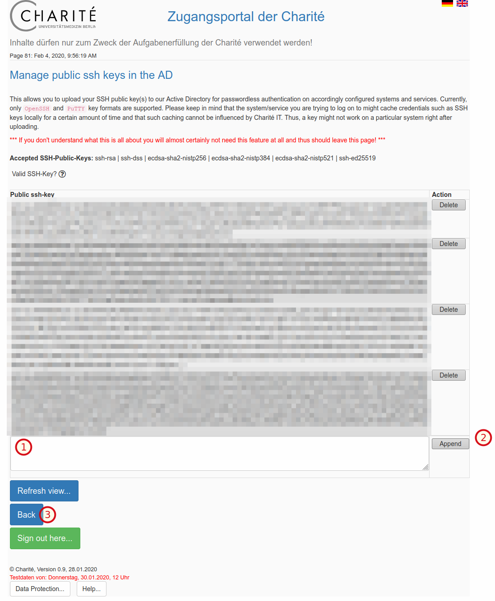

# Submitting an SSH Key to Charite

As of February 2020, SSH key submission **not accepted via email** anymore.
Instead, use the process outline here.

For any help, please contact helpdesk@charite.de (as this site is maintained by Charite GB IT).

### Charite Zugangsportal

Key are submitted in the Charite Zugangsportal.
As of Feb 4, you have to use the "test" version for this.

Go to [zugang.charite.de](https://zugang.charite.de) and login.

Follow through the login page until you reach the main menu (it's tedious but we belive in you ;)
Click the "SSH Keys" button.

Paste your SSH key (starting with `ssh-rsa`) and ending with the label (usually your email, e.g., `john.doe@charite.de`) into the box (1) and press append (2). By default, the key can be found in the file `~/.ssh/id_rsa.pub` in Linux. If you generated the key in Windows, please paste the copied key from the text box.
Repeat as necessary.
Optionally, go back to the main menu (3) when done.

If you have generated your SSH key with PuTTy, you must right click on the ppk-file, then choose "Edit with PuTTYgen" in the right click menu. Enter your passphrase. Then copy the SSH key out of the upper box (already highlighted in blue).

Once your key has been added, it will take a few minutes for the changes to go live.
