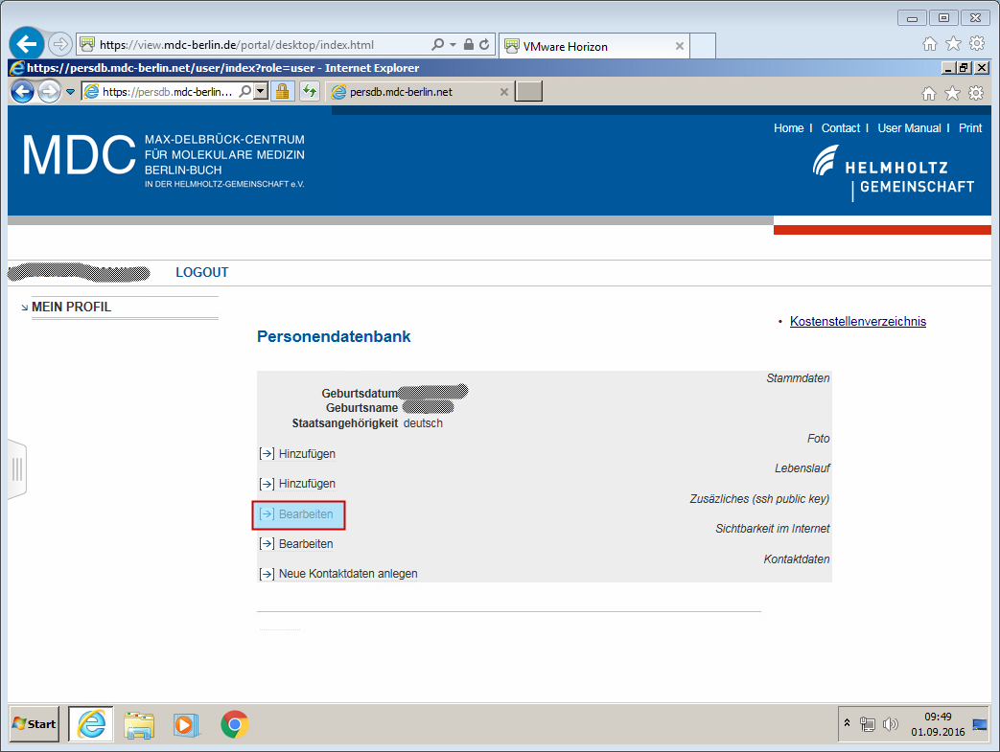

# Submitting an SSH Key to MDC

For MDC users, SSH keys are submitted through the MDC PersDB interface (see below).
PersDB is not maintained by BIH HPC IT but by MDC IT.

!!! warning
    The SSH keys are only activated over night (but automatically).
    This is out of our control.
    Contact helpdesk@mdc-berlin.de for more information.

## Detour: Using MDC VMWare View to get into MDC Intranet

In case you are not within the MDC network, connect to MDC VMWare view first and use the web brower in the Window session.

- Go to the [MDC VMWare View](https://view.mdc-berlin.de)
- Click "VMWare Web Viewer"
- Login with MDC username and password.
- Select Windows 7.
- Open Firefox or Internet Browser

## Enter MDC PersDB

- If you are inside MDC network, you can start here, OR
- If you have the MDC VMWare Web Viewer open, start here.

### Log into MDC PersDB

- Open https://persdb.mdc-berlin.net/login
- Login with MDC username and password again

### Click on "Mein Profil"

### Click on "Zusaetzliches (ssh public key) -> Bearbeiten"

- This is the middle item.

### Click "Neue zusaetzliche Eigenschaft anlegen"

- Most probably, you don't have any entries yet.

### Activate the VMWare View Menu

- This is the only way to get your SSH key into the clipboard of the Windows instance that has MDC PersDB open. :rolleyes:

### Activate Clipboard Window

1. Click (middle) clipboard button.
2. The clipboard window appears.
3. Close the VMWare View window again.

### Register SSH key

1. Paste SSH key from `~/.ssh/id_rsa.pub` into the clipboard window. Ensure that the whole file contents is there (should end with your email address). If you generated the key in Windows, please paste the copied key from the text box.
2. Left-click the "Inhalt" text box to put the cursor there
3. Right-click the "Inhalt" text box, make the context menu appear, and click "Einfuegen"
4. Click Submit

### You're Done

  Thus, you will only be able to connect the next day.
- Bask in the glory of having completed this process.
