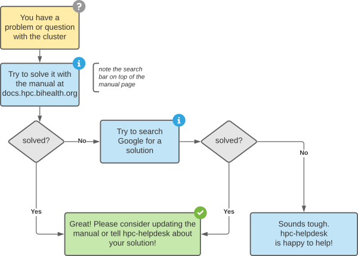

# HPC IT Helpdesk

!!! faq "Getting Help"
    Our helpdesk can be reached via email to hpc-helpdesk@bihealth.de.
    Please read our guide on [how to write good tickets](help/good-tickets) first.

Note that there also is the bih-cluster@charite.de email address that you can user for user discussions and getting support from other users (in particular for things out of scope for the helpdesk).

Please also use the handy figure below on general problem resolution.

{: .center}

## Helpdesk Scope

Our helpdesk can support you in the following areas:

- Problems/questions with connecting to the clusters.
- Problems/questions  with using the cluster scheduler or operating system.
- Requests for the installation of common software.
- Problems with running your software that works in other environments.

We will try our best to resolve these issues.
Please note that all other questions can only be answered in a "best effort way".

## Helpdesk Non-Scope

The following topics are out of scope for the BIH HPC Helpdesk:

- Generic Linux or programming questions (try [stackoverflow.com](http://stackoverflow.com)).
- Managing users, groups, and projects on the clusters (use hpc-gatekeeper@bihealth.de).
- Generic help with Snakemake or other workflow engines (See [Stackoverflow](https://stackoverflow.com/questions/tagged/snakemake) for getting help with Snakemake).
- Help with bioinformatics or other scientific software.
  Please contact the authors/communities of these software for help (also known as "upstream").

We're happy to see if we can help when there is a concrete problem with the software, e.g.,

- something that breaks from one week to another without you changing anything and you assume a change on the cluster, or
- you need a generic dependency that you cannot install via conda or on your own.
  Please read the section [Administration-Provided Software](../../admin/provided-software/) to learn about the kinds of software that we will install and the kinds that we will not.
