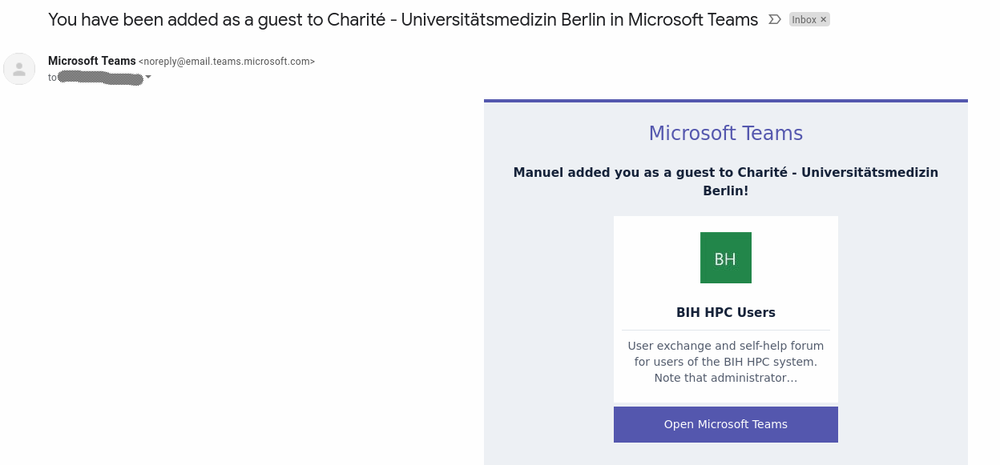

# User Self-Help Teams

We user a "Microsoft Team" group (called... team) for HPC users to exchange information and help each other.

## Charite Users

You will get an invite to your Charite email address that you can follow to join the team.
In case of any problems with Teams please contact the helpdesk of central IT at helpdesk@charite.de.

## MDC Users

You will get an email to your MDC email address that will look as follows:

Follow the "Open Teams" link and you will need to create a Microsoft account if you don't already have one.

Finally, you will open Teams and you can join the discussion.
