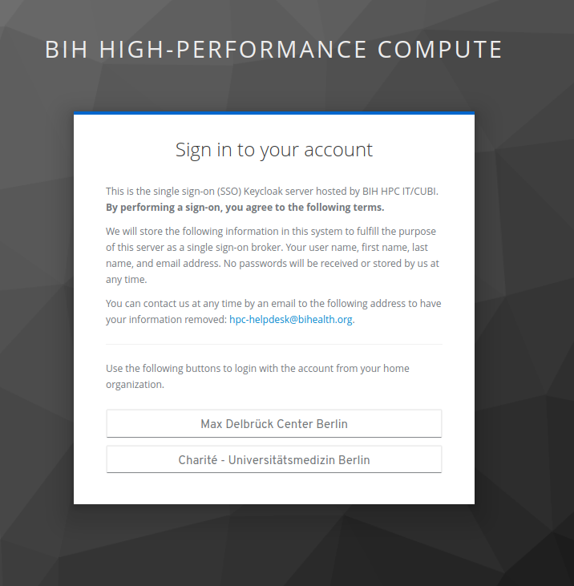

# Accessing HPC Talk

We provide a user forum using the Discourse software at

- https://hpc-talk.cubi.bihealth.org

## Log In!

First of all, visit the website for the first time: https://hpc-talk.cubi.bihealth.org

You will then be directed to our Single-Sign-On Page.

{: style="width: 50%;" .center}

Use the appropriate button for your host organisation (MDC / Charite) where also your cluster account belongs to.

Then use the usual of your host organisation.

!!! tip "Clicked wrong organisation?"

    If you accidentally clicked the wrong institution then you need to clear your browser history up to the point where you clicked (e.g., for the last hour).

    - [Delete your Chrome browsing history](https://support.google.com/chrome/answer/95589)
    - [How do I delete browsing history in firefox](https://support.mozilla.org/de/questions/1166873)

## First Steps

You will be shown the following screen after the first login.

{: style="width: 50%;" .center}

You can proceed with reading the notification or split it.
The site is mostly self-explanatory.
let us point you at a couple of interesting things for first steps.

Here you can setup your preferences

{: style="width: 50%;" .center}

Use the "New Topic" button to create a new topic.
Set a meaningful title, select a suitable category (we will update the list of categories over time), and write down your question or discussion item.
Finally, click "Create Topic" to create the new topic.

{: style="width: 50%;" .center}

You will be directed to the page with your new topic.

{: style="width: 50%;" .center}

You can enable email notifications to receive emails if someone answers.

## Closing Remarks

We established the HPC Talk forum as a self-help forum for users.
Alas, there is a number of such sites out there already that are populated by more users.

**How does HPC Talk fit in?**

We think it is most useful for asking questions and discussing points that are directly related to the BIH HPC system.

**What alternatives do I have?**

For example:

- [Stack Overflow](https://stackoverflow.com/) for general programming questions, including Python/R programming
- [Cross Validated](https://stats.stackexchange.com/) for questions regading statistics
- [Unix & Linux Stack Exchange](https://unix.stackexchange.com/) for discussing all sorts of Linux/Unix questions
- [Super User](https://superuser.com/) for certain more advanced Unix topics
