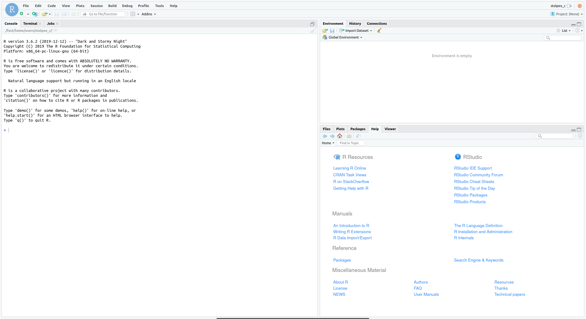

# OnDemand: Interactive Sessions

Interactive sessions allow you to start and manage selected apps. Depending
on the app they run as servers or GUIs. Selecting `My Interactive Sessions`
in the top menu will direct you to the overview of currently running sessions.
The left-hand panel provides a short cut to start a new session of one of the
provided apps.

{: style="width:90%;" .center}

Each running interactive session is listed. Each card corresponds to one session.
The title of each card provides the name, allocated resources and the current status.
Furthermore, detailed information and links are available:

- **Host**: Provides the name of the node the session is running on. Click on the host name to open a shell to the given cluster node.
- **Time remaining**: Time until session till terminate.
- **Session ID**: Click to open the session directory in the interactive file browser (see below).
- **Connect to**: This will open the app in your browser (opens a new tab).
- **Delete**: Terminate the session.

!!! important "Don't hit reload in your apps"

    Please note that the portal will use the authentication mechanisms of the apps to ensure that nobody except for you can connect to the session.
    This means that hitting the browsers "reload" button in your app will most likely not work.

    Just go back to the interactive session list and click on the "connect" button.

## Session Directories

The portal software will create a folder `ondemand` in your home directory.
Inside, it will create session directories for each started interactive job.
For technical reasons, these folders have very long names, for example:

- `$HOME/ondemand/data/sys/dashboard/batch_connect/sys/ood-bih-rstudio-server/output/e40e03b3-11ca-458a-855b-98e6f148c99a/`

This follows the pattern:

- `$HOME/${application name}/output/${job UUID}`

The job identifier used is **not** the Slurm job ID but an identifier internal to OnDemand.
Inside this directory you will find log files and a number of scripts that are used to start your job.

If you need to debug any interactive job, start here.
Also, the helpdesk will need the path to this folder to help you with interactive jobs.

You can find the name of the latest output folder with the following command:

```bash
$ ls -lhtr $HOME/${application name}/output | tail -n 1
```

For example, for RStudio Server:

```bash
$ ls -lhtr $HOME/ondemand/data/sys/dashboard/batch_connect/sys/ood-bih-rstudio-server/output | tail -n 1
```

!!! important "Prevent Home From Filling Up"

    You should probably move `~/ondemand` to your work volume with the following:

    ```bash
    $ mv ~/ondemand ~/work/ondemand
    $ ln -sr ~/work/ondemand ~/ondemand
    ```

    Make sure to delete potential interactive sessions and to logout from the
    Ondemand Portal first. Otherwise, the `~/ondemand` folder is constantly
    recreated and the symlink will be just created within this folder as
    `~/ondemand/ondemand` and thus not be used as intended.

    Also, clear out `~/work/ondemand/*` from time to time but take care that you don't remove the directory of any running job.
    

## Example: RStudio Session

This description of starting an RStudio session is a showcase for starting other interactive apps as well.

To start the session, please go to `Interactive Apps` in the top menu bar and select `RStudio Server` or click `RStudio Server` in the left-hand panel.

{: style="width:90%;" .center}

Allocate appropriate resources and click `Launch`.

An info card for the RStudio Server will be added to `My Interactive Sessions`, and during start,
it will change its state from `Queued` to `Starting` to `Running`. Depending on the app, resources allocated and
current cluster usage, this will take a couple of seconds.


{: style="width:90%;" .center}


{: style="width:90%;" .center}


{: style="width:90%;" .center}


When in the final state (`Running`), one can directly connect to the RStudio Server
to get an interactive session by clicking `Connect to RStudio Server`:

{: style="width:90%;" .center}
