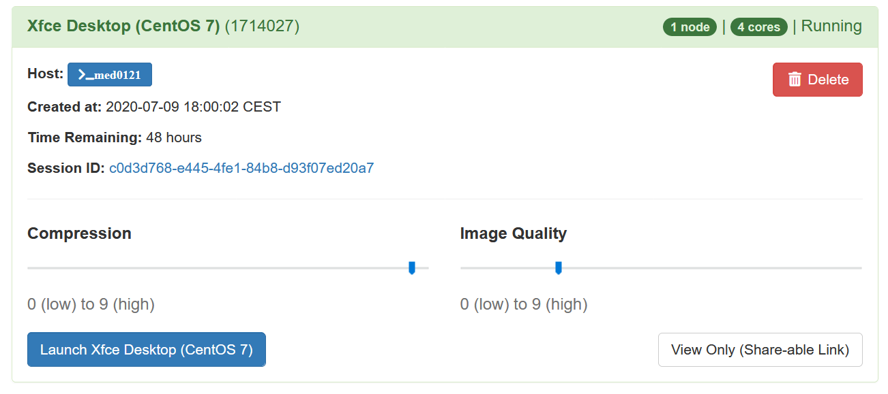
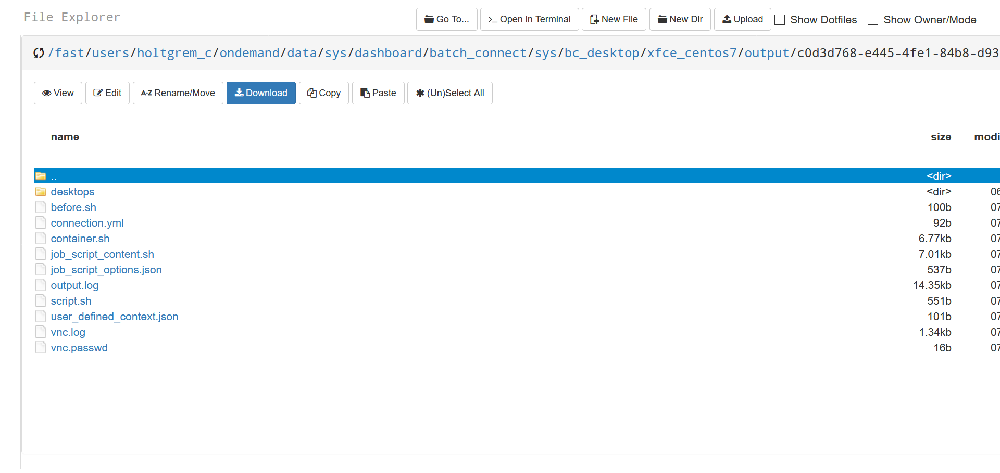

# Desktops

You can launch both an Xfce and Mate desktop based on CentOS 7.
The desktops themselves are pretty boring and more exposed as technology demos.
Also, the other desktop applications are based on Singularity container images that are based on the images of the Xfce Desktop.
Here, we use them to inspect the basic characteristics of a portal-launched job.

## Launching

You can launch a remote desktop through the "Interactive Apps" menu in the top menu bar.

*Above: links to the interactive apps in the portal.*

This will bring you to the remote desktop launch form.
The remote desktop will be started as a Singularity container running in a Slurm batch job.
The `/fast` file system will be available in the desktop.

*Above: desktop launch menu.*

You can control job parameters such as the number of hours to run, the number of CPUs to allocate, and the partition to run within.
Your remote desktop will behave just as any batch job.
This implies, it has to adhere to the resource limitations that you set on launching.
In particular, it will be terminated after the given running time.
Also, you can later inspect it with the Slurm commands and terminate it using the `scancel` command.

When you are happy with the settings then press the "Launch" button.
The portal will now create a job for launching your job and you are asked to be patient until the job has been launched.

## Connecting

Once the job has been lanuched, you will be presented with the following job overview.
This includes display of the Slurm job ID and the number of cores that are allocated to your job.

*Above: desktop job overview.*

The overview contains a number of helpful elements:

- `>_<hostname>` -- this button allows you to open an SSH shell to the given job in your browser
- "Delete" button -- cancel your job from your browser
- "Session ID" link -- this will bring you to your job's working directory
- "Compression" -- select degree of lossless graphics compression (always keep high)
- "Image Quality" -- select degree of lossy graphics compression (if you have good network connectivity, increase)

And finally, the "Launch Xfce Desktop (CentOS 7)" button which will start the remote desktop session within noVNC.
Also see the [noVNC notes](novnc.md) for details on noVNC.

## The Working Directory

Clicking on the session ID (which is not the same as the job ID by the way) brings you to the portal file browser of the job working directoyr.

*Above: file browser in working directory.*

The interface is pretty intuitive and we will not go into much detail here.
However, we'd like to point out that the `output.log` file captures the logs of the job.
In case that your job fails, this is the best way to start looking for the reason.

Please also note that you can find all session files by following the "data root" links displayed below the the desktop launch form.
You can sort the "output" folder below this by date and the latest directory most probably is your previously failed job in case you try to locate the session directory.
