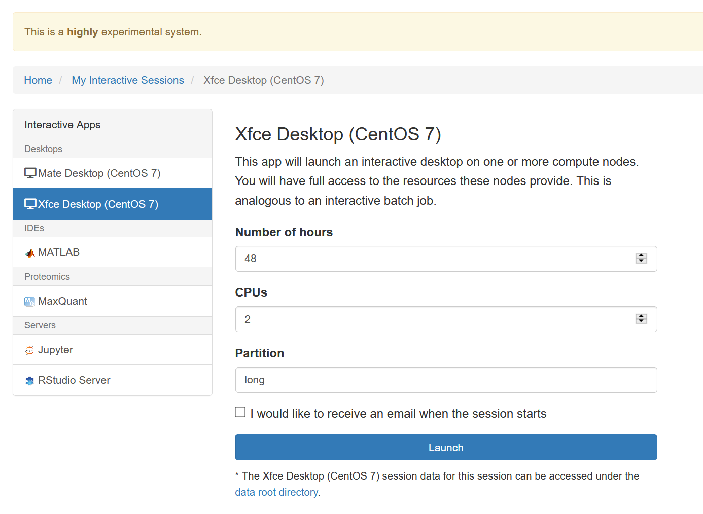

# Jupyter

Jupyter is a web-based notebook system that was formerly known as "iPython Notebooks".
Jupyter allows you to create Python notebooks but also notebooks using other languages in so-called *kernels*.
Jupyter Notebooks is the successor of iPython Notebooks and itself succeeded by JuptyerLab.

Jupyter is built using web technology, meaning that you can directly connect to it with your browser without VNC.
This implies better speed and also better integration into your browser, in particular regarding key strokes and the clipboard (copy-and-paste).
You can also launch Jupyter programs on the HPC without the portal and build connections to them using SSH tunnels.
You can also find documentation for doing this elsewhere in the manual.
However, it is much more convenient and less error prone to use the portal to launch Jupyter.

## Launching

You can launch a Jupyter instance through the "Interactive Apps" menu in the top menu bar.

*Above: links to the interactive apps in the portal.*

This will bring you to the Jupyter launch form.
Jupyter will be started as Singularity container running in a Slurm job.
The `/fast` file system will be available in the desktop.

*Above: desktop launch menu.*

You can control job parameters such as the number of hours to run, the number of CPUs to allocate, and the partition to run within.
You can also select whether to start Jupyter Notebook or JupyterLab.

By default, the job will use the Python installation from the Singularity image.
You can change this by selecting "miniconda" for the "Python Source" and provide a path to your miniconda3 installation's `bin` directory and the conda environment is appended, separated by a colon `:`.

Your Jupyter instance will behave just as any batch job.
This implies, it has to adhere to the resource limitations that you set on launching.
In particular, it will be terminated after the given running time.
Also, you can later inspect it with the Slurm commands and terminate it using the `scancel` command.

When you are happy with the settings then press the "Launch" button.
The portal will now create a job for launching your job and you are asked to be patient until the job has been launched.

## Connecting

Once the job has been lanuched, you will be presented with the following job overview.
This includes display of the Slurm job ID and the number of cores that are allocated to your job.

*Above: Jupyter job overview.*

The overview contains a number of helpful elements:

- `>_<hostname>` -- this button allows you to open an SSH shell to the given job in your browser
- "Delete" button -- cancel your job from your browser
- "Session ID" link -- this will bring you to your job's working directory

And finally, the "Launch Jupyter" button which will connect to Jupyter in a new browser tab.

## The Working Directory

Clicking on the session ID (which is not the same as the job ID by the way) brings you to the portal file browser of the job working directoyr.

*Above: file browser in working directory.*

The interface is pretty intuitive and we will not go into much detail here.
However, we'd like to point out that the `output.log` file captures the logs of the job.
In case that your job fails, this is the best way to start looking for the reason.

Please also note that you can find all session files by following the "data root" links displayed below the the desktop launch form.
You can sort the "output" folder below this by date and the latest directory most probably is your previously failed job in case you try to locate the session directory.
