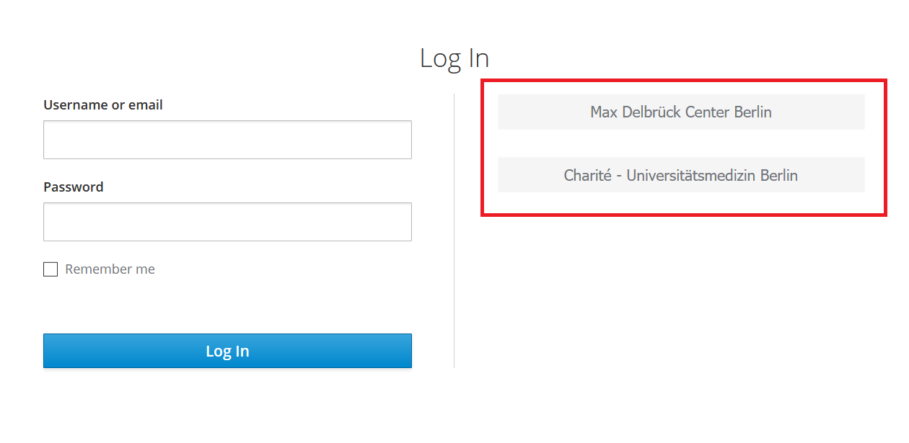

# Login & Logout

Logging into the portal is based on the SSO (single-sign-on) solution keycloak that we host at sso.hpc.bihealth.org.
You can login either with your Charite or your MDC credentials.

## Two-Factor Authentication

During your first login, you will have to setup two-factor authentication (2FA) based on FreeOTP.
Two factor authentication aims at improving authentication security by adding a second security factor beyond your password.
In short, two factor authentication requires you to proof your identity with:

- something that you know (your parent organization's login), and
- something that you *have*.

There are various options for the second factors including hardware tokens.
However, we decided to use a software-based second factor based on FreeOTP which is an app that is available for Android and iPhone smartphones.
We require two factor authentication for the portal to provide state-of-the art protection of the potentially sensitive human data being processed by you on the BIH HPC.

On your first login into the portal, you will first be redirected to your parent organization's authentication website to enter your user name and password.
Afterwards, you will have to connect first 2FA devices which will require you to install the FreeOTP app on your smartphone.
Subsequent logins will require you to confirm your login with the 2FA app.
You can later add more devices by logging into our SSO website at https://sso.hpc.bihealth.org/XXXTODOXXX (which will of course require the 2FA).
In the case of loss or damage of your 2FA device, please contact hpc-helpdesk@bihealth.de.

## Login

Simply go to https://portal.research.hpc.bihealth.org.
You will then

{.width}

*Above: the SSO login screen.*

## Logout

You can find the "logout" link on the top right of the portal website.
Note that this will only log you out of the web frontend of the portal.
Your launched applications will continue to live as Slurm jobs and you can reconnect to them the next time that you log into the portal.