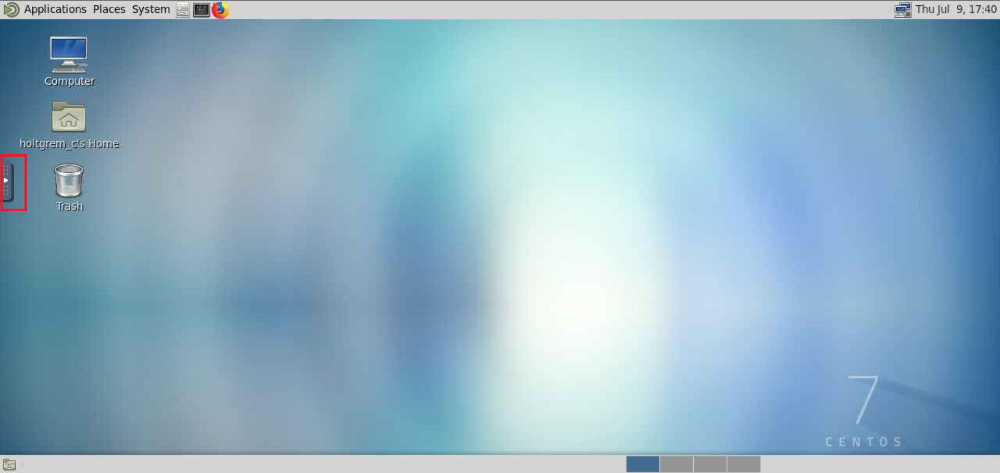

# noVNC

In contrast to RStudio Server and Jupyter, some applications in the portal are not based on web technology.
They rather are classic desktop applications.
For connecting to them via your browser, we use the VNC (virtual network computing) technology.
Your browser will run the web application noVNC and then connect to the desktop program running on the HPC using the VNC protocol.
In case you have ever used it, this is very similar to using virtual desktop infrastructure (VDI).

At first, this might sound a bit weird but it actually works very well and smooth.
However, some limitations apply:

- Your browser will not capture all keyboard strokes.
  For example, F11 will probably make your browser be displayed in full screen.
  Also, shortkeys involving Ctrl will perform actions in your web browser (e.g., Ctrl-W will close the current tab).
- The clipboard will not be shared automatically with the remote desktop.
  Rather, you have to use the explicit clipboard described below.
- The "noVNC connect" that appears when the connection is lost does not work.
  Rather, you have to go back into the portal and click again on the "Launch" button.

Using noVNC is very intuitive.
You should not overlook the little fold-out menu on the left of the screen.

After clicking, you will be presented with the options to make the VNC window full-screen or open the clipboard or keyboard tool.

The clipboard manager allows you to paste data from your computer to the remote desktop system.
The process is as follows.
First, you paste the data into the clipboard tool's text area.
This will set the clipboard contents of the remote desktop.
You can then paste *within the remote desktop*.

The keyboard tool allows you to enter key combinations that would otherwise be captured by your browser (e.g., Ctrl-W).
