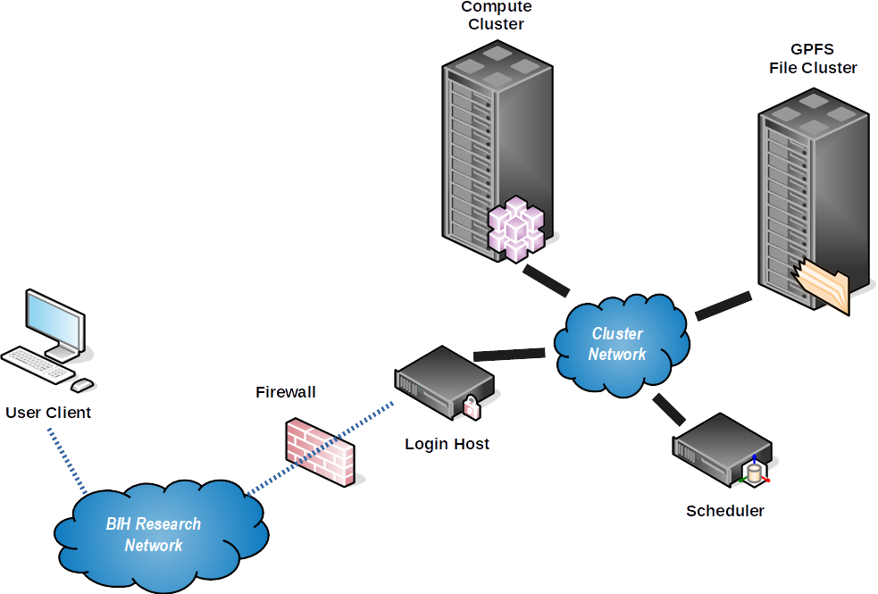

# For the Impatient

This document describes the fundamentals of using the BIH clusters in a very terse manner.

## HPC 4 Research vs. HPC 4 Clinic

BIH HPC IT operates two clusters: HPC 4 Research and HPC 4 Clinic.

**HPC 4 Research** is the older and larger of both.
It is located in the BIH data center in Buch and connected via the BIH research networks.
Connections can be made from Charite, MDC, and BIH networks.
The cluster is open for users with either Charite or MDC accounts after [getting access through the gatekeeper proces](../admin/getting-access.md).
The system has been designed to be suitable for the processing of human genetics data from research contexts (and of course data without data privacy concerns such as public and mouse data).

**HPC 4 Clinic** (BETA) is the more recent and smaller cluster.
It is located in the Charite data center on the Charite Campus Virchowklinikum and connected only to the Charite network ("Kernnetz").
Connections can only be made from Charite networks.
The cluster is open for users with a Charite account after [getting access through the gatekeeper proces](../admin/getting-access.md).
The system has also been designed to be suitable for the processing of human genetics data but is located within the hospital physical walls and network firewalls.
It is thus also suitable for the processing of data from clinical context.
Administration provides a system with state of the art IT security, users are responsible to obtain proper data privacy and ethics votes.

!!! important "HPC 4 Clinic is in Beta Status"

    Do not use for production purposes or with critical data during beta test!
    We will notify you when the HPC 4 Clinic cluster becomes stable.

## Cluster Hardware and Scheduling

=== "HPC 4 Research"

    The cluster consists of the following major components:

    - 2 login nodes for users `login-1` and `login-2` (for interactive sessions only),
    - 2 nodes for file transfers `transfer-1` and `transfer-2`,
    - a scheduling system using Slurm,
    - approximately 200 general purpose compute nodes `med01XX`, `med02XX`, `med05XX`, `med06XX`, `med07XX`.
    - a few high memory nodes `med040[1-4]`,
    - 4 nodes with 4 Tesla GPUs each (!) `med030[1-4]`,
    - a high-performance, parallel GPFS file system with 2.1 PB, by DDN mounted at `/fast`,
    - a slower "classic" ZFS file system available through NFS with ~250 TB mounted at `/slow`.

    This is shown by the following picture:

    

=== "HPC 4 Clinic"

    The cluster consists of the following major components:

    - 2 login nodes for users `login-1.clinic.hpc.bihealth.org` (and `login-2`).
    - a scheduling system using Slurm,
    - 24 general purpose compute nodes `cc-node0[00-23]`
    - 3 nodes with 4 Tesla GPUs each (!) `cc-node02[4-6]`
    - an Isilon scale-out NAS system mounted at `/data/isilon-1` with ~1.2PB of space (~100TB on SSDs).

## Differences Between Workstations and Clusters

The differences include:

- The directly reachable login nodes are not meant for computation!
  Use `srun` to go to a compute node.
- Every time you type `srun` to go to a compute node you might end up on a different host.
- Most directories on the nodes are not shared, including `/tmp`.
- The `/fast` directory is shared throughout the cluster which contains your home, group home, and project directories.
- **You will not get `root` or `sudo` permissions on the cluster.**
- You should prefer *batch jobs* (`sbatch`) over calling programs interactively.

## What the Cluster Is and Is NOT

NB: the following might sound a bit harsh but is written with everyone's best intentions in mind (we actually like you, our user!)
This addresses a lot of suboptimal (yet not dangerous, of course) points we observed in our users.

**IT IS**

- It is scientific infrastructure just like a lab workbench or miscroscope.
  It is there to be used for you and your science.
  **We trust you** to behave in a collaboratively.
  We will monitor usage, though, and call out offenders.
- With its ~200 nodes, ~6400 threads and fast parallel I/O, it is a powerful resource for life science high performance computation, originally optimized at bioinformatics sequence processing.
- A place for data move data at the beginning of your project.
  By definition, every project has an end.
  **Your project data needs to leave the cluster at the end of the project.**
- A collaborative resource with central administration managed by BIH HPC IT and supported via hpc-helpdesk@bihealth.de

**IT IS NOT**

- A self-administrated workstation or servers.
    - You will not get `sudo`.
    - We will not install software beyond those in broad use and available in CentOS Core or EPEL repositories.
    - You can install software in your user/group/project directories, for example using Conda.
- A place to store primary copies of your data.
  You only get 1 GB of storage in your home for scripts, configuration, and documents.
- A safe place to store data.
  Only your 1 GB of home is in snapshots and backup.
  While data is stored on redundant disks, technical or administrative failure might eventually lead to data loss.
  We do everything humanly possible to prevent this.
  Despite this, it is your responsibility to keep important files in the snapshot/backup protected home, ideally even in copy (e.g., a git repository) elsewhere.
  Also, keeping safe copies of primary data files, your published results, and the steps in between reproducible is your responsibility.
- A place to store data indefinitely.
  The fast GPFS storage is expensive and "sparse" in a way.
  The general workflow is: (1) copy data to cluster, (2) process it, creating intermediate and final results, (3) copy data elsewhere and remove it from the cluster
- Generally suitable for primary software development.
  The I/O system might get overloaded and saving scripts might take some time.
  We know of people who do this and it works for them.
  Your mileage might vary.

## Locations on the Cluster

- Your home directory is located in `/fast/users/$USER`.
  **Your home is for scripts, source code, and configuration only.**
  **Use your `work` directory for large files.**
  **The quota in the `home` directory is 1 GB but we have nightly snapshots and backups thereof.**
- Your work directory is located in `/fast/users/$USER/work`.
  This is where you should place large files.
  Files in this location do not have snapshots or backups.
- The directory (actually a GPFS file set) `/fast/users/$USER/scratch` should be used for temporary data.
  **All data placed there will be removed after 4 weeks.**
- If you are part of an AG/lab working on the cluster, the group directory is in `/fast/groups/$AG`.
- Projects are located in `/fast/projects/$PROJECT`.

!!! important "So-called dot files/directories filling up your home?"

    Files and directories starting with a dot "`.`" are not shown with the "ls" command.
    May users run into problems with directories such as `$HOME/.local` but also non-dot directories such as `$HOME/R` filling up their storage.
    You should move such large directories to your work volume and only keep a symlink in your `$HOME`.

    Here is how you find large directories:

    ```bash
    host:~$ du -shc ~/.* ~/* --exclude=.. --exclude=.
    ```

    Here is how you move them to your work and replace them with a symlink, e.g., for `~/.local`:

    ```bash
    host:~$ mv ~/.local ~/work/.local
    host:~$ ln -s ~/work/.local ~/.local
    ```

    Also see the [related FAQ entry](../../help/faq/#help-im-getting-a-quota-warning-email).

### Temporary Directories

Note that you also have access to `/tmp` on the individual nodes but the disk is **small** and might be a **slow** spinning disk.
If you are processing large NGS data, we recommend you create `/fast/users/$USER/scratch/tmp` and set the environment variable `TMPDIR` to point there.
However, for creating locks special Unix files such as sockets or fifos, `/tmp` is the right place.
**Note that files placed in your `scratch` directory will be removed automatically after 4 weeks.**
**Do not place any valueable files in there.**

## First Steps on the Cluster

### Connecting to the Cluster

=== "HPC 4 Research"

    - From the Charite, MDC, and BIH networks, you can connect to the cluster login nodes `login-{1,2}.research.hpc.bihealth.org`.
        - For Charite users, your name is `${USER}_c`, for MDC users, your account is `${USER}_m` where `$USER` is the login name of your primary location.
    - From the outside, **for MDC users**, the cluster is accessible via `ssh1.mdc-berlin.de` (you need to enable SSH key agent forwarding for this)
        - Note that you have to use your MDC user name (without any suffix `_m`) for connecting to this host.
        - Also note that BIH HPC IT does not have control over `ssh1.mdc-berlin.de`.
          *You have to contact MDC IT in case of any issues.*
    - From the outside, **for Charite** users, there is no SSH hop node.
      Instead, you have to apply for VPN through Charite Geschäftsbereich IT.
      You can use [this form availble in Charite Intranet](https://intranet.charite.de/fileadmin/user_upload/portal/service/service_06_geschaeftsbereiche/service_06_14_it/VPN-Zusatzantrag_O.pdf) for this.
      Please refer to the Charite intranet or helpdesk@charite.de for more information.
    - Also consider using the [OnDemand Portal](../ondemand/overview.md) at https://portal.research.hpc.bihealth.org.

=== "HPC 4 Clinic"

    - You have to login from the Charite network with your charite account to `login-{1,2}.clinic.hpc.bihealth.org`.
    - Access from VPN is currently not possible.
    - Also consider using the [OnDemand Portal](../ondemand/overview.md) at https://portal.clinic.hpc.bihealth.org.

### Connecting to Compute Node through Login Node

After logging into the cluster, you are on the login node `<cluster>-login<X>` (`<cluster>` is either `res` for HPC 4 Research and `cln` for HPC 4 Clinic; `<X>` can be either `1` or `2`).
When transferring files, use the `transfer-1` or `transfer-2` nodes (HPC 4 Research only).
You should not do computation or other work on the login or file transfer nodes, but use the compute nodes instead.
Typically, you'll create an interactive session on a compute node using the `srun` command.

### Submitting Jobs

While not recommended, you can perform computations (such as using BWA) in the interactive session.
However, when the connection is interrupted, your computation process will be stopped.
It is therefore recommended you submit jobs using the `sbatch` command (or [use screen or tmux](../best-practice/screen-tmux.md)).

Details on how to use Slurm `srun`, `sbatch`, and and other commands can be found in the [Cluster Scheduler](../slurm/overview.md) section.

### Inspecting Jobs and the Cluster

You can inspect your currently running jobs with `squeue`, and kill them using `scancel`.
You can inspect jobs that have finished with `sacct`, and see the cluster nodes using `sinfo`.
